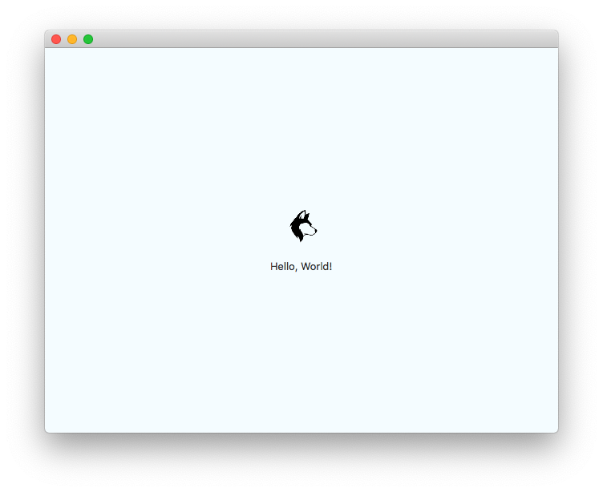

# NodeGUI + Parcel Example App
This is a simple "hello world" app that incorporates `parcel-plugin-nodegui` for bundling assets for nodegui projects.



## Running It Locally
### Quickstart
1. Clone this repo
2. Run `npm install`
3. Use the build script to build the project: `npm run build`
4. Run the project using `npm start`

### Fiddling With The Project
If you want to play around with the project, you can run parcel in watch mode:
```bash
npm run watch
```

Now every change you make is immediately bundled, so you can simply run `npm start` and your changes will be reflected in the application immediately!
